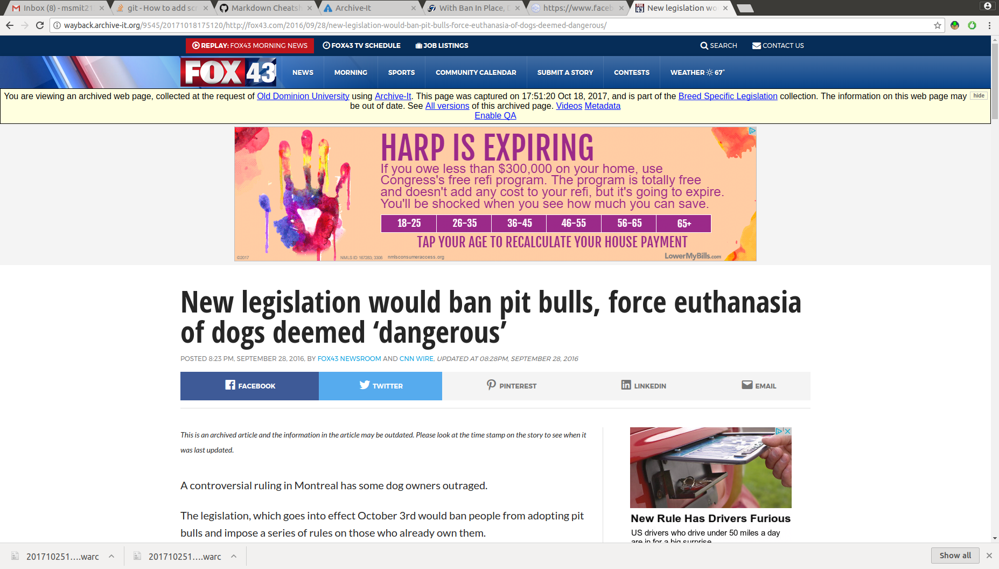
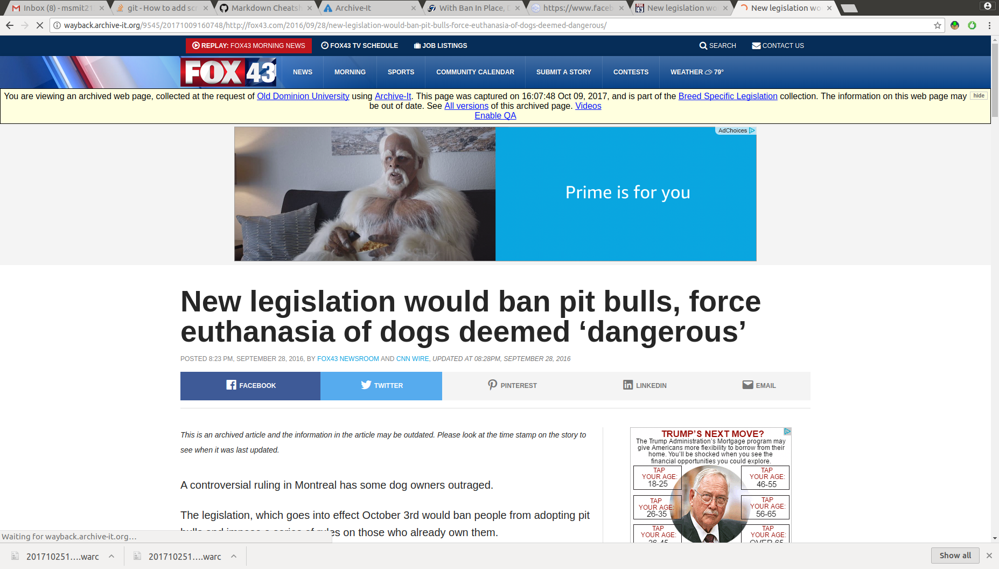
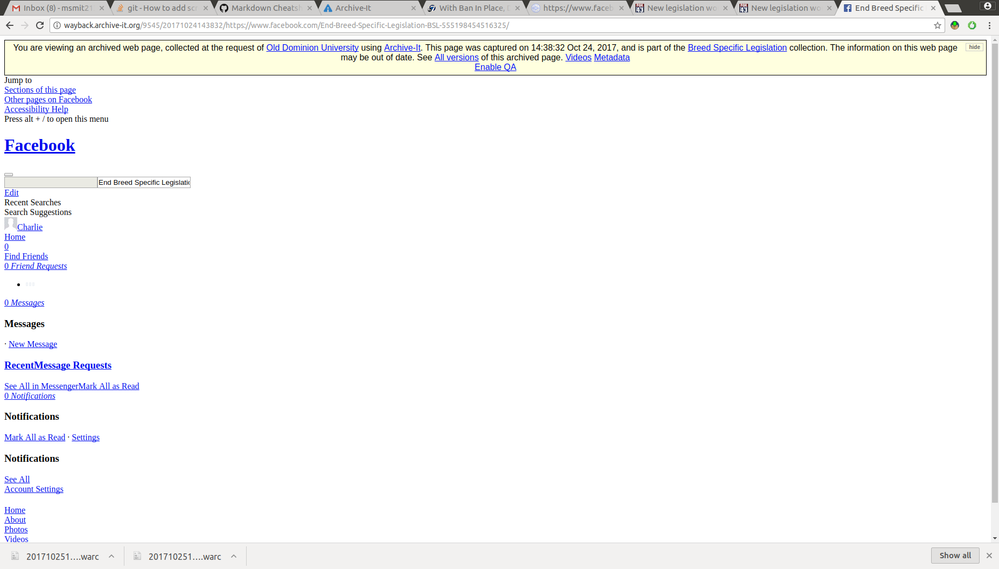
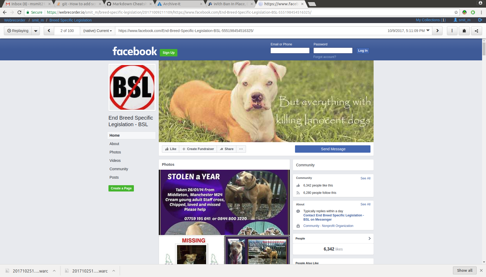
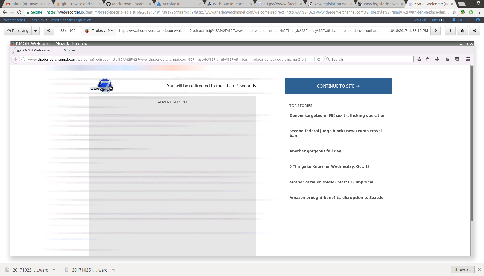
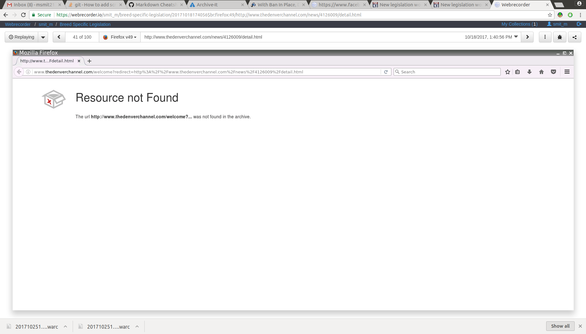
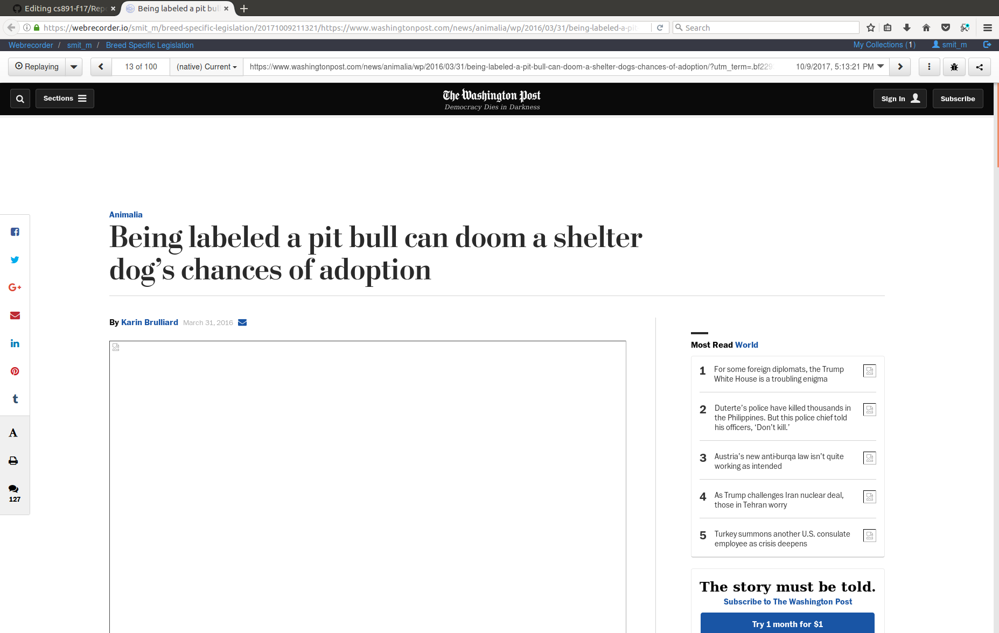
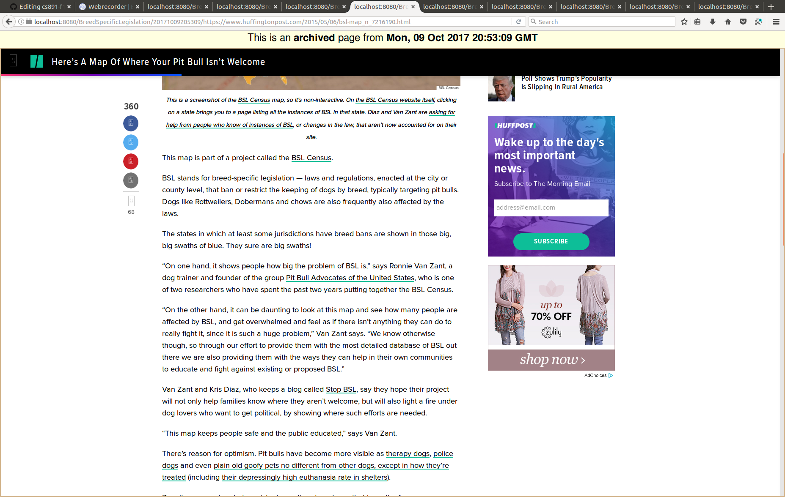
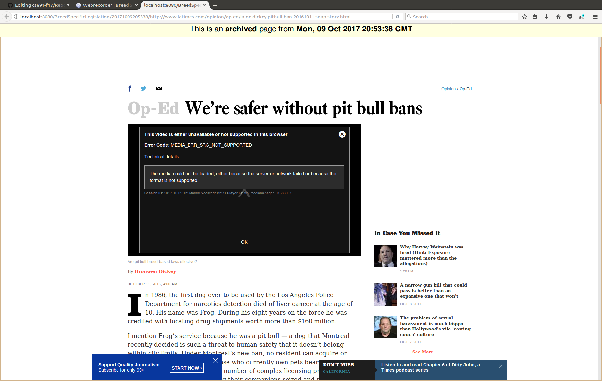
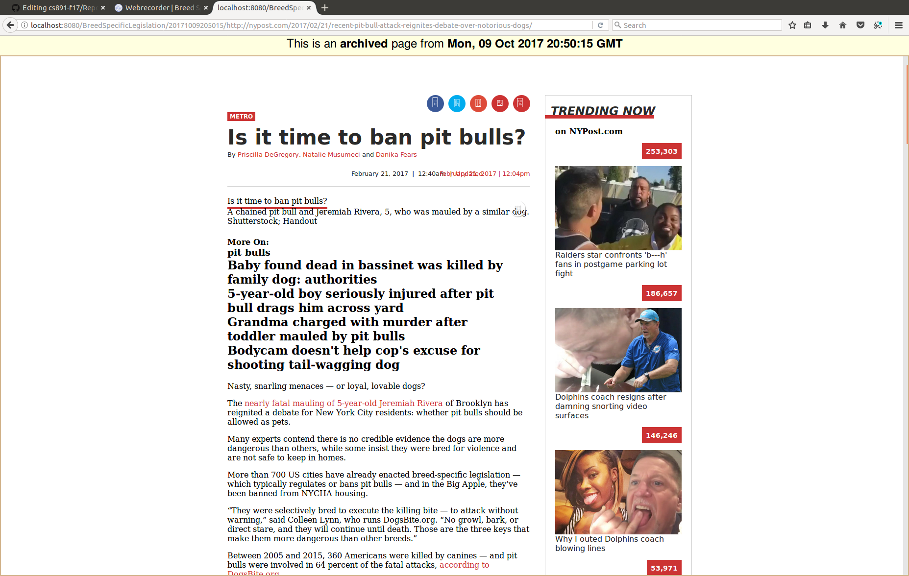

Archiving Report
================
Miranda Smith CS891
---------------------

Experiences creating collection with the four diffrent tools 
+ Archive-It
+ webrecorder.io
+ WAIL
+ WARCreate

### Archive-It

__Advantages__

Very easy to use. Exellent user interface.
Example of page chances:

fox 43 has different ads and weather

Huff post shows page with properly formmatted images and links and navigation bar

__Disadvantages__ 

Crawl does take quite a bit of time. Must prepare beforehand and let it sit.

Does not collect FaceBook pages well

__When Recommended__

When you aren't doing Javascript heavy things. Easiest to use, would be my first choice.

### webrecorder.io

__Advantages__

Webrecorder is much better at facebook pages

It takes much more time to collect a page, so the user visually sees it and knows when it has been collected properly.
Their browsers seem to be better, however they are *much* slower.

It recorded the AD

__Disadvantages__ 

takes much more time to collect. Would only work for small collections, but would work well.
When an error occurs it will still save that- bad data taking up space

Using the native browser to replay can show different things.

Chrome:

Firefox:

__When Recommended__

When collecting a small amount of pages, and have the time to manually browse them all.

### WAIL

__Advantages__

Works quickly compared to the online archiving tools.

Example of grabbing links and ads:

__Disadvantages__ 

Hard to keep track of which pages have errors.
UI is confusing and is too transparent to actual processes. Should abstract that stuff to make use easier to quickly understand.
Does not allow quick viewing of all available momentos at once.

Error with video: 

Error with grabbing photo: 

Errors with grabbing icons 
__When Recommended__

Best when you want to be able to see archived pages offline.

### WARCreate
__Advantages__

__Disadvantages__ 

Uncommunicative. Usually doesn't report when warcs created imporperly until being imported to WAIL. Because of the file naming scheme you then have no idea which seed went wrong if you are trying to do multiple at the same time.
Does not do anything when button pushed occasionaly. Very large delay between activating the extention and file download. No reporting if an error occured, if it got the input of me pushing the button.
Very low return rate of pages that get a correctly warc file that will display in WAIL when using Chromium or Chrome.

__When Recommended__

I don't.
